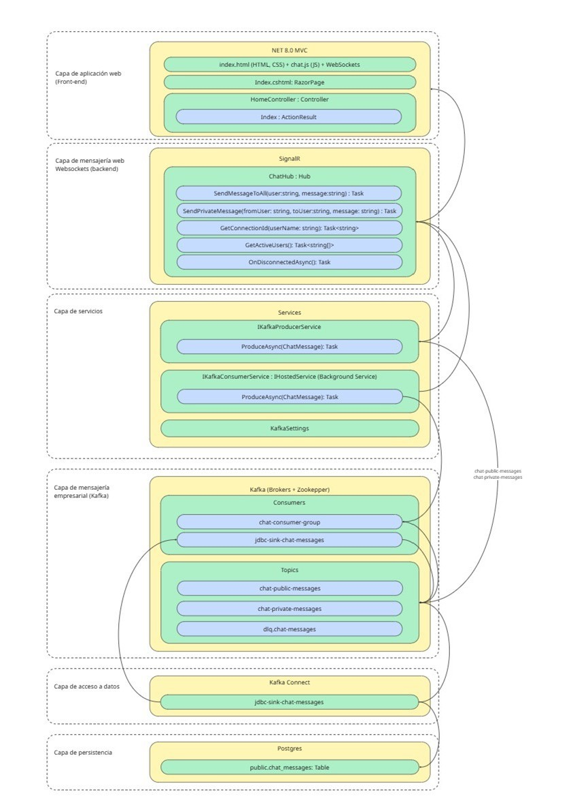

# ChatApp con Kafka y .NET

## Descripción
ChatApp es una aplicación de chat en tiempo real desarrollada en **.NET** que utiliza **Apache Kafka** como sistema de mensajería.  
Permite el envío y recepción de mensajes entre usuarios, soportando tanto chats públicos como privados, y almacena los mensajes en una base de datos **PostgreSQL** mediante un conector JDBC Sink.

## Propósito
El propósito del proyecto es demostrar una arquitectura moderna basada en eventos, integrando **Kafka** con una aplicación **.NET** para comunicación en tiempo real, utilizando contenedores **Podman** para la orquestación de servicios.

## Prerrequisitos
Antes de iniciar, asegúrate de tener instalados los siguientes componentes:

- **Ubuntu 22.04+**
- **Podman 4.0+**
- **Podman Compose**
- **.NET 8.0 SDK o superior**
- **Git**

## Arquitectura

La arquitectura está compuesta por los siguientes servicios:



### Flujo general
1. El usuario envía un mensaje desde la aplicación .NET.
2. El mensaje se publica en el **topic** de Kafka correspondiente.
3. Kafka Connect utiliza el conector **JDBC Sink** para insertar el mensaje en **PostgreSQL**.

## Estructura del proyecto

```
/IaC
 ├── config-environment.sh         # Script para levantar y configurar la infraestructura.
 ├── init-db.sql                   # Script de inicialización de la base de datos
 ├── jdbc-sink-chat-messages.json  # Configuración del conector JDBC Sink
 ├── podman-compose.yml            # Definición de los contenedores
/chatApp
 ├── DAO/                          # Modelos de datos
 ├── Hubs/                         # Implementación SignalR
 ├── Services/                     # Productor y consumidor Kafka
 ├── Program.cs                    # Punto de entrada de la aplicación
 ├── appsettings.json              # Configuración de la aplicación de Chat
```

## Instrucciones para levantar los ambientes

### Clonar el repositorio
```bash
git clone https://github.com/m1m0sin/kafka_chatdemo.git
cd kafka_chatdemo
```

### Levantar la infraestructura
Desde el directorio `/IaC`:
```bash
chmod +x *.sh
./config-environment.sh
```

Esto realizara las siguientes tareas:

- Inicializar los contenedores:
    - `zookeeper`
    - `kafka`
    - `connect`
    - `postgres`
- Instalar el conector JDBC para POSTGRES.
- Crear la estructura de la tabla `public.chat_messages` en la base de datos.
- Configurar el conector JDBC para consumir los mensajes de los topics `chat-public-messages` y `chat-private-messages` y almacenarlos en la tabla `public.chat_messages`.

### Ejecutar la aplicación .NET
Desde el directorio raíz del proyecto:
```bash
dotnet restore chatApp
dotnet build chatApp
dotnet run --project chatApp
```

### Acceder a la aplicación de Chat
Abrir en el navegador:
```
http://localhost:5098
```

### Consultar los Topics y Consumers en Kafka
Abrir en el navegador:
```
http://localhost:8080
```

### Consultar los registros en base de datos Postgres
Desde el directorio `/IaC`:
```bash
./query-db.sh
```

## Autor
**Tito Peralta**  
_Caso de estudio: Chat en tiempo real utilizando Kafka_

